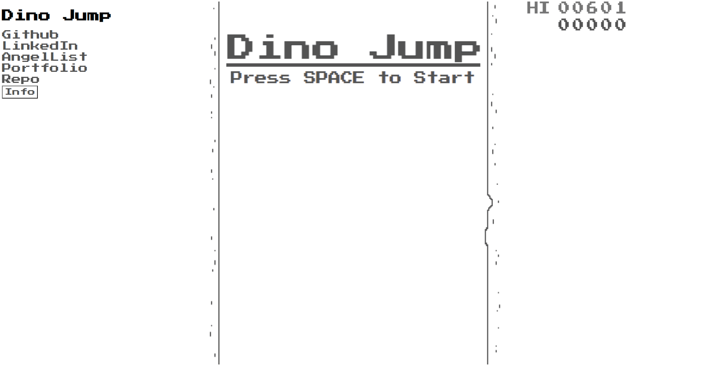
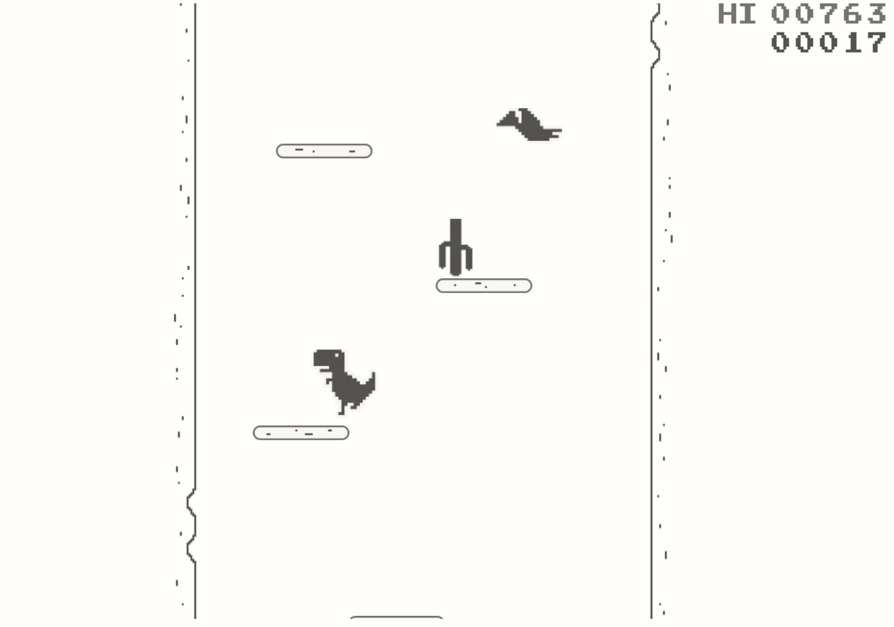

# Dino Jump

[Live Demo](https://andrewyoo94.github.io/Dino-Jump/)

A fully interactive JavaScript and HTML5 Canvas game that takes inspiration from the offline Google Chrome Dino game. Built using a custom physics engine that supports collision detection of many objects at once and manages movement patterns, gravity, and condition for each player, obstacle, and background. Complete with sounds and high score using local storage.

### Technology 
* JavaScript
* CSS
* Canvas



## Title Screen

For the title screen I wanted to create a interactive and visually appealing aesthetic instead of a static screen. Once SPACE is pressed to start the game the title falls down out of frame, adhering to the concept of the game. The borders are an endless "waterfall" that give off the illusion of climbing up. Using numerous checks, I was able to create a consistent border animation that does not re-render/disconnect and only pauses when game is over.  

```
moveBorders() {
    // Moves borders down in right and left arrays
    this.eachBorderLeft(function (border) {
        border.y += CONSTANTS.BORDER_SPEED;
    });
    this.eachBorderRight(function (border) {
        border.y += CONSTANTS.BORDER_SPEED;
    });

    // Pushes new border into the array when end of first border drops into frame
    if (this.borderLeft[0].y >= 0 && this.borderLeft.length < 2) {
        this.borderLeft.push(this.newBorder("left", CONSTANTS.NEW_BORDER_Y_COORD));
        this.borderRight.push(this.newBorder("right", CONSTANTS.NEW_BORDER_Y_COORD));
    }

    // Shifts leading border out of array once its off screen
    if (this.borderLeft[0].y >= CONSTANTS.CANVAS_HEIGHT) {
        this.borderLeft.shift();
        this.borderRight.shift();
    }
}

```



## Gameplay

One of the most challenging and important part of this project was collision detection. Having to deal with various game states depending on the multitudes of different objects made this difficult. 

```
collidesWith(dino) {
    const dino_y_offset = 60;

    //this function returns true if the dino and plat objects overlap
    const collisionCheck = (obj, dino) => {
        //check that they don't overlap in the x axis
        if (obj.x > dino.x + dino.width || obj.x + obj.width < dino.x) {
            return false;
        }

        //check that they don't overlap in the y axis
        if (dino.y + dino_y_offset > obj.y + obj.height || dino.y + dino_y_offset < obj.y) {
            return false;
        }

        return true;
    };

    const cactus_x_offset = 20;
    const cactus_y_offset = 25;

    //this function returns true if the dino and cactuses overlap
    const cactusCheck = (cactus, dino) => {
        //check that they don't overlap in the x axis
        if (cactus.x + cactus_x_offset > dino.x + dino.width || cactus.x + cactus.width - cactus_x_offset < dino.x) {
            return false;
        }

        //check that they don't overlap in the y axis
        if (dino.y + cactus_y_offset > cactus.y + cactus.height || dino.y + dino.height < cactus.y) {
            return false;
        }

        return true;
    };

    let collision = false;

    // Checks for collision with dino and all platforms
    this.eachPlat((plat) => {
        if (collisionCheck(plat, dino)) {
            collision = true;
        }
    });

    // Checks for collision with dino and birds. Sets bird.pos = "dead" to change bird sprite to dead bird sprite
    this.eachBird((bird) => {
        if (collisionCheck(bird, dino)) {
            collision = true;
            bird.pos = "dead";
        }
    });

    // Checks for collision with dino and cactus only after delay for cactus spawn
    this.eachCactus((cactus) => {
        if (cactus.timer > 55) {
            if (cactusCheck(cactus, dino)) {
                collision = "cactus";
            }
        }
    });

    return collision;
}

```

## Future Implemenations 
* Improve physics of dino
* Offscreen bubble dino title sprite
* Mute audio button
